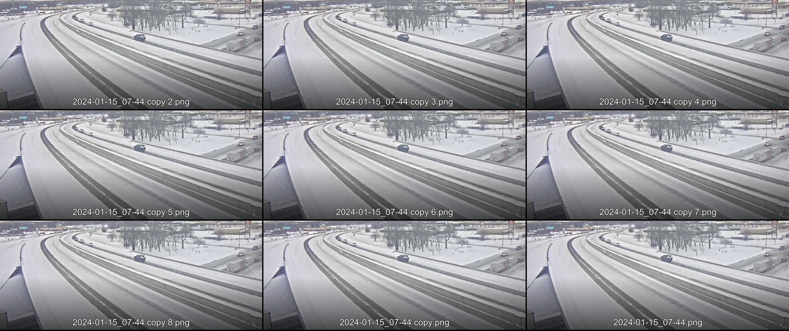

# Collage Maker

Build quick collages from input images in folder, resulting in a single image with file names treated as captions for each image.

MVP project; limited devoted development time; expect bugs and limited features.

## Native System Usage

```bash
# Python 3.6+ required.
pip install pillow

python collage_builder.py <input_folder_path> <output_image_name>

# EXAMPLE with sample images provided in project
python collage_builder.py ./images_all_same images_all_same_resolution.jpg
python collage_builder.py ./images_different_resolutions images_all_different_resolutions.jpg
```

Included is blank `images` folder for usage.
The `./` in the file path denotes "the current directory" relative to where this python script is being run from.

## MVP Usage Notes

- Max Column Number is 3 images
- Program sorts the images in the input folder by file name; draws in sorted order.
- If images all have different resolutions, grid created based on the largest resolution.
- Smaller Images will be upscaled to 75% of the largest resolution image, toggled with `UPSCALE_SMALL_IMAGES` in `collage_builder.py` - TODO make this a CLI argument.
- Font size is set with `FONT_SIZE` in `collage_builder.py` - TODO make this a CLI argument.
- Image text will be added at -100px from the bottom of the images - TODO make this a CLI argument.
- Virtually 0 error handling; input validation is minimal.

## Sample Output Images

### `images_all_different_resolutions.jpg`


### `images_all_same_resolution.jpg`

